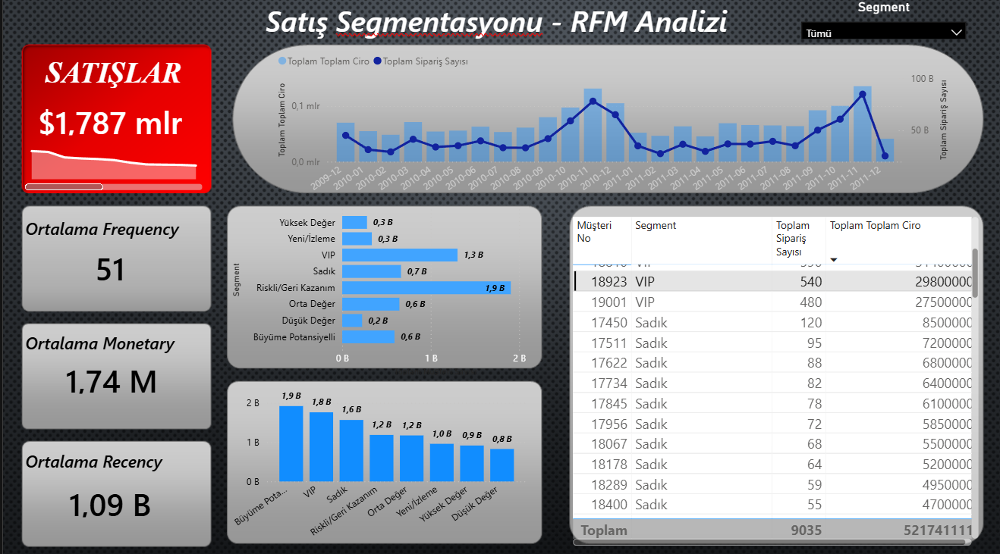

# RFM Customer Segmentation with Python, SQL & Power BI

Bu proje, müşteri davranışlarını analiz ederek işletmelerin **en değerli müşterilerini belirlemesini**, **riskli müşteri gruplarını tespit etmesini** ve **segment bazlı kararlar almasını** sağlamak amacıyla hazırlanmıştır.

Analiz sürecinde Python ve SQL kullanılarak RFM metrikleri hesaplanmış, elde edilen segmentasyon çıktıları Power BI dashboard’ları ile **görselleştirilerek hikâyeleştirilmiş** ve karar vericiler için anlaşılır hale getirilmiştir.

---

## 📊 Power BI Dashboard – Genel Bakış

---

### ℹ️ RFM Nedir?

RFM (Recency, Frequency, Monetary) analizi; müşterilerin **son alışveriş zamanı**, **alışveriş sıklığı** ve **harcama tutarı** gibi davranışsal metriklere göre segmentlere ayrılmasını sağlayan, pazarlama ve müşteri yönetiminde yaygın olarak kullanılan bir analiz yöntemidir.

---

## 🎯 Projenin Amacı

Bu projenin temel amacı:

- Yüksek değerli müşterileri belirlemek  
- Kaybedilme riski taşıyan müşteri segmentlerini tespit etmek  
- Müşteri davranışlarını sayısal metriklerle ölçmek  
- Analitik sonuçları **iş kararlarına dönüştürülebilir** hale getirmek  

Bu sayede işletmelerin pazarlama, kampanya ve müşteri yönetimi stratejileri **veriye dayalı** olarak şekillendirilebilir.

---

## 🧠 Proje Yaklaşımı

Proje kapsamında:

- Ham satış verileri Python ile temizlenmiş ve analize hazır hale getirilmiştir  
- RFM metrikleri SQL kullanılarak müşteri bazında hesaplanmıştır  
- Müşteriler RFM skorlarına göre segmentlere ayrılmıştır  
- Segmentasyon sonuçları Power BI dashboard’ları ile görselleştirilmiştir  

Power BI bu projede bir hesaplama aracı değil, **analiz çıktılarının etkili biçimde sunulduğu bir karar destek katmanı** olarak kullanılmıştır.

---

## 🛠️ Kullanılan Teknolojiler

- Python (pandas, numpy)
- SQL (T-SQL)
- Power BI
- Excel / CSV veri kaynakları

---

## 📑 Proje Çıktıları

- RFM analiz ve segmentasyon SQL sorguları  
- Python veri ön işleme ve hazırlık kodları  
- Power BI dashboard (.pbix)  
- Detaylı analiz raporu (Word)  

Bu çıktılar hem **teknik inceleme** hem de **iş sunumları** için uygundur.

---

## 📌 Kullanım Alanları

Bu proje;
  
- Şirketler için müşteri segmentasyonu ve karar destek örneği  
- CV ve GitHub portföylerinde uçtan uca veri analizi projesi  

olarak kullanılabilir.

## 👨‍💻 Hazırlayan
**Yunus Ahmet Dokazoğlu** 
📍 Ankara, Türkiye  
🔗 [GitHub Profilim](https://github.com/AhmetDokazoglu)  
🔗 [LinkedIn Profilim](https://www.linkedin.com/in/ahmet-dokazo%C4%9Flu-9660b2346/)

## 📎 Ek Dökümanlar  
📄 [Proje Raporunun Word Versiyonu (İndir)](https://github.com/AhmetDokazoglu/Crypto-and-Gold-Price-Analysis-ML/raw/refs/heads/main/Kripto%20ve%20Alt%C4%B1n%20Fiyatlar%C4%B1n%C4%B1n%20Analizi%20ve%20Makine%20%C3%96%C4%9Frenmesi%20ile%20%C3%96ng%C3%B6r%C3%BCs%C3%BC.docx)   

